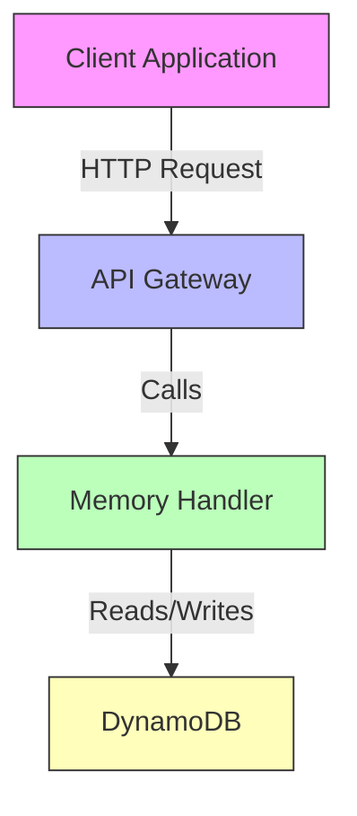
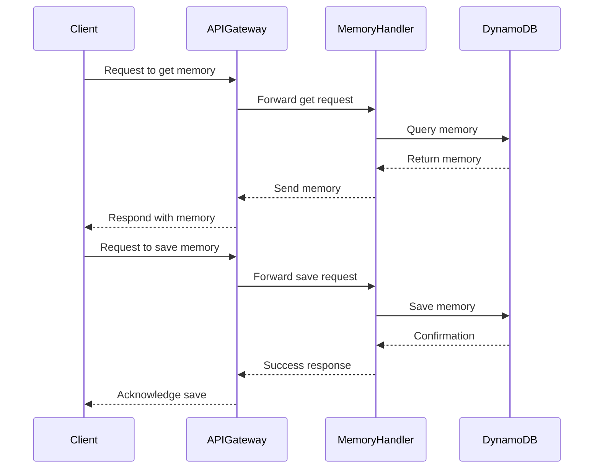

# Memory App

## Memory Flow

```mermaid
graph TD
Client[Client Application] -->|HTTP Request| APIGateway[API Gateway]
APIGateway -->|Calls| MemoryHandler[Memory Handler]
MemoryHandler -->|Reads/Writes| DynamoDB[DynamoDB]

    style Client fill:#f9f,stroke:#333,stroke-width:1px
    style APIGateway fill:#bbf,stroke:#333,stroke-width:1px
    style MemoryHandler fill:#bfb,stroke:#333,stroke-width:1px
    style DynamoDB fill:#ffb,stroke:#333,stroke-width:1px
```

```mermaid
sequenceDiagram
    participant Client
    participant APIGateway
    participant MemoryHandler
    participant DynamoDB

    Client->>APIGateway: Request to get memory
    APIGateway->>MemoryHandler: Forward get request
    MemoryHandler->>DynamoDB: Query memory
    DynamoDB-->>MemoryHandler: Return memory
    MemoryHandler-->>APIGateway: Send memory
    APIGateway-->>Client: Respond with memory

    Client->>APIGateway: Request to save memory
    APIGateway->>MemoryHandler: Forward save request
    MemoryHandler->>DynamoDB: Save memory
    DynamoDB-->>MemoryHandler: Confirmation
    MemoryHandler-->>APIGateway: Success response
    APIGateway-->>Client: Acknowledge save
```
